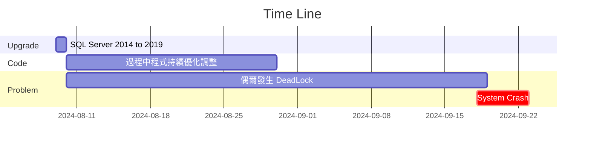

## SQL Server database deadlock
案例分析報告

---

## 事件如何發生?



<!-- .slide: data-background="https://raw.githubusercontent.com/1013033/Pic/refs/heads/main/clock2.jpg" data-background-opacity="0.3" -->

---

## 前情提要...
:::info
* Q：結報 & GBA介接開出多張傳票的情況？
  * 一筆API-Request，DB產生多筆相同資料 
* 發生過程中，做了甚麼?
  * kill process
  * DB Server Restart
* 造成結果
  * 可能 AP Server process Redo
:::


----

#### 在系統Crashed前...程式改了甚麼? 

:::info
Date: 113/08/20-113/09/07
SVN: 14413、14414、14415
:::

:::warning
* 「轉製傳票」按鈕、詢問視窗之「確定」按鈕等等沒有鎖定，調整為按下按鈕就反灰。
  * (防止使者者可能同一時間點好幾次轉製按鈕。)
* 轉製過程增加顯示等待圖示。
  * (防止使者者無法判斷是否未按下轉製按鈕，或是不確定畫面是否在有進行。)
:::


----

:::info
Date: 113/08/20-113/09/07
SVN: 14413、14414、14415 (Cond.)
:::

:::warning
* 後端增加控制，在最後寫入資料庫前，利用前端的body串流轉md5來判斷相同的畫面是否被提交兩次。
  * (防止前端同時間送出相同的請求。)
* 增加每五秒查詢執行狀態以確定畫面連線不會hold住不動。
  * (讓本次交易每5秒送出一次請求來保證連線不會因為逾時中斷。)
:::

----

:::info
SVN: 14497 
:::

:::warning
* Read & Write 使用不同的 datasource
  * 傳票計算餘額(Read)
  * 傳票資料存檔(Write)
:::

----

:::info
SVN: 14497 
:::
:::warning
* 監控SQL執行結果
  * 增加p6spy工具來監控SQL執行結果(暫時僅針insert、select紀錄)，並增加logs\cgba-p6spy.log檔案來紀錄執行過程。
:::
<BR>


----

:::info
SVN: 14536 
:::

:::warning
* 降低資料庫查詢傳票撈取的資料量，只取必要資料
* "SELECT * " 與 "SELECT att.1, att.2 "執行時間差異
:::

----

:::info
SVN: 14570 
:::

:::warning
* 將commit進行記錄，寫至log檔，確保commit正常執行。
:::
<BR>
 


---

### 我在113年9月20日做了甚麼?
#### 嗯......Deadlock....所以......😕

---

## 已知的資訊📧
<BR>

<BR><BR>

#### 嗯...他在幹嘛 ?🤔

----

### SQL Statement 1 / 2
:::danger
沖銷餘額計算....Join AG_Voucher
:::

<BR>


----

### SQL Statement 2 / 2
:::danger
傳票資料寫入....Insert AG_Voucher
:::

<BR>


---

### 嗯...這些資訊對我來說足夠嗎 ?

<BR>

### ...我似乎需要更多的資訊?......😕

---

## 我怎麼想?🤔
:::warning
* Cycle? 
* Deadlock 類型是?
* Deadlock 圖長怎樣?
* 可以用 SQL Server Profile 嗎?
* 可以用 Extented Events 嗎?
:::

<!-- .slide: data-background="https://raw.githubusercontent.com/1013033/Pic/refs/heads/main/think1.jpg" data-background-opacity="0.6" -->

----

### 🔖第一步: 收集更多資料

#### **使用 SQL Server Profile**

<BR>

#### **使用 Extented Events**

<!-- .slide: data-background="https://raw.githubusercontent.com/1013033/Pic/refs/heads/main/data1.jpg" data-background-opacity="0.4" -->

----

### SQL Server Profile
:::danger
但...失敗了....Why?😱
:::

:::danger
:fire: Profile資料收集需耗費很高的執行成本 
導致 GBA 系統無法順利運作，DeadLock更加嚴重了
:::

:::warning
:mega: **有甚麼替代方案?** 
擴展事件(Extented Events)
:::

<!-- .slide: data-background="https://raw.githubusercontent.com/1013033/Pic/refs/heads/main/SQL_Profiler.png" data-background-opacity="0.4" -->

----

### Extented Events👍
:::success
輕量級的效能監控與資料收集
:::

:::success
預設已設定 system health
:::

:::danger
但，預設的東西，檔案太小且雜訊太多
:::

----

:::danger
嗯...為了長時間收集資訊....
<BR>
我需自己建立屬於自己的Extented Events😕
:::

<!-- .slide: data-background="https://raw.githubusercontent.com/1013033/Pic/refs/heads/main/system_health.png" data-background-opacity="0.2" -->

----

#### 如何建立新的Extented Events?(這裡不贅述)
:::info
1. 管理 → 擴充事件 → 工作階段 →「新增工作階段精靈」，透過精靈式的完成相關設定。
2. 設定一個工作階段的名稱
3. 可以看到類似 SQL Profiler ，選擇「TSQL_Locks」的範本
4. 此時可以看到右邊「選取的事件」中，已經自動加入 Deadlock 所需要紀錄的資訊。
5. 為了後續方便查詢和使用，建立一個目錄用來存放擴充事件中所記錄下來的資訊
:::

---

### 🔖第二步: 如何打開收集到的資訊
* xml_deadlock_report
* DeadLock圖
* Lock類型

<!-- .slide: data-background="https://raw.githubusercontent.com/1013033/Pic/refs/heads/main/data2.jpg" data-background-opacity="0.2" -->


----

### 如何取得xml_deadlock_report?
:::success
Extented Events
:::

<BR>


----

### xml_deadlock_report長這樣...

```xml
<deadlock>
<victim-list><victimProcess id="process1719d45a108"/></victim-list>
<process-list>
<process waitresource="PAGE: 24:1:969290 " waittime="3957" ownerId="37197047" 
transactionname="implicit_transaction" lockMode="IX" 
clientapp="Microsoft JDBC Driver for SQL Server" 
hostname="V5P-CGBA-AP5" loginname="cgbasys" 
isolationlevel="read committed (2)" currentdbname="WGBA2300A">
<executionStack><frame ...> unknown </frame></executionStack>
<inputbuf>(@P0 nvarchar(4000),@P55 varchar(8000),</inputbuf>
</process>
</process-list>
</deadlock>
```

---

### 嗯...我該怎麼解析呢?😕

----

#### 我該怎麼解析 xml_deadlock_report?😕
:::success
SolarWinds-PlanExplorer
:::
<BR>


----

####  我該怎麼將 xml 轉換成 XDL?
:::success
Deadlock gragh By 使用 SolarWinds-PlanExplorer
:::
<BR>


----

#### SQL Server紀錄甚麼?
:::success
S mode and IX mode deadlock
:::
<BR>


---

### 🔖第三部: 查看 DeadLock 資訊

:::success
xml_deadlock_report
<BR>
DeadLock Graph
:::

----

### 嗯...我得到了甚麼?

<BR>

### 我的瓶頸在哪裡?😕

----

### 我得到了
:::info
* Write-Read lock
* Page Lock
* lock type IX
* Lock Escalation(擴大鎖定)
* 瓶頸在 AG_Voucher 資料表
:::


<!-- .slide: data-background="https://raw.githubusercontent.com/1013033/Pic/refs/heads/main/office3.jpg" data-background-opacity="0.2" -->

----

#### 此時，浮現了幾個疑問......🤔
:::danger
* 鎖定類型是 Write-Read Lock.
    * Process 1 擁有 S-Lock(共享鎖)，and 等待 IX-Lock(意向鎖)
    * Process 2 擁有 IX-Lock(意向鎖)，and 等待 S-Lock（共享鎖）
* 為甚麼鎖定不是 Row Lock? 
* 為何發生Lock Escalation?
* 為甚麼 INSERT 指令會執行這麼久?
* 我的交易有正常commit嗎
* Index是否有破碎? 
:::


<!-- .slide: data-background="https://raw.githubusercontent.com/1013033/Pic/refs/heads/main/office7.jpg" data-background-opacity="0.2" -->

---

### ✨過程中，嘗試了許多方法
:::warning
* Try 1: 停用 lock escalation
* Try 2: 檢查 index 破碎百分比
* Try 3: 交易讀寫分離
* Try 4: 調整 JDBC connection timeout 設定
* Try 5: 更新 SQL SERVER patch
* Try 6: 更新 JDBC Driver for SQL Server
:::

<!-- .slide: data-background="https://raw.githubusercontent.com/1013033/Pic/refs/heads/main/office6.jpg" data-background-opacity="0.2" -->

---

### 為甚麼我懷疑 lock escalation?
:::danger
* 因為 Extented Events 告訴了我 
* 而且發生頻率極高
* 所以我懷疑.....
:::
<BR>


----

### 💫嘗試停用 lock escalation

:::warning
如何確定是 lock escalation
:::

:::success
查看 Extended Events s是否包含 lock_escalation event.
:::

:::danger
**But intent lock (such as a lock mode of IS, IU, or IX), this isn't caused by lock escalation.** (當下沒注意到這一點😤)
:::

----

### 如何停用 lock escalation
```sql
ALTER TABLE ... SET (LOCK_ESCALATION = DISABLE)
```
<BR>

### 如何啟用 lock escalation
```sql
ALTER TABLE ... SET (LOCK_ESCALATION = TABLE)
```

---

### 💫 INSERT 指令為何執行這麼久?
:::warning
* 可能因素: Index 破碎
  * 15% 以下：正常
  * 15% - 30%: REORGANIZE 
  * 超過 30%: REBUILD
  * 結果: 數值在正常範圍
:::
<BR>


----

### 🌟意外發現其他index問題🌟
:::success
* 相同index重複建立2次 
* 有何影響? 造成insert執行時間拉長
* 感謝：中菲電腦
:::
<BR>


---

### 💫嘗試進行交易讀寫分離
:::danger
* 修改傳票存檔程式
* 結果: 問題依然存在😨
* 感謝：長官建議
:::

---

### 💫嘗試調整 Tomcat JDBC connection timeout
:::danger
* 修改 JDBC connection pool 設定
* 結果: 問題依然存在😮‍💨
* 感謝：長官建議
:::

---

### 💫嘗試更新 SQL SERVER patch
:::warning
* 手動更新 KB5042214 and KB5042749 patch (發行日期： 2024 年 8 月 1 日，版本： 15.0.4385.2) 
* 結果: 問題依然存在😵
* 感謝：維運科、藍新資訊協助
:::
<BR>


---


#### 💫嘗試更新 JDBC Driver for SQL Server
:::success
* 更新版本從 4.X 到 12.8.1 (版本號碼：12.8.1 發行日期: 2024年8月22日)
* 過程中, 嘗試更新到 7.4 但系統功能失效.
* 結果：好像成功了，感謝晶茂公司 👌
:::
<BR>


---

## 各方建議因系統已穩定，所以未嘗試進行

---

#### 建議 1: 調整 JDBC unreturnConnectionTimeout 
```xml
<property name="hibernate.c3p0.unreturnedConnectionTimeout">30</property>
<property name="hibernate.c3p0.debugUnreturnedConnectionStackTraces">true</property>
```
* 感謝：長官建議

---

#### 建議 2: read committed snapshot isolation
:::info
* 將 TRANSACTION ISOLATION LEVEL 設定為 read committed snapshot isolation 
* 感謝：Microsoft SQL Team
:::

<BR>


---

#### 建議 3: Using 'nolock' parameter
:::info
* 當然根據您的顧慮和系統對資料敏感度的考慮，我們可以嘗試另一種方法：使用“nolock”參數，讓SELECT語句不要申請S鎖，減少鎖的申請數目，從而消除死鎖
* 感謝：Microsoft SQL Team
:::
```sql
SELECT attribute_1,attribute_2... FROM TABLE with（nolock） WHERE...
```

---

#### 我的疑問，來自Microsoft的回覆內容?
:::warning
* Q1: 有關deadlock情形與SQL server升級是否有關
  * Ans: deadlock發生在併發性方面，當事務請求鎖之間被互相佔用時會發生死鎖，所以我認為與升級沒有太大關係。
* Q2: JDBC的升級是否與死鎖有關？
  * Ans: 我認為造成死鎖的主要原因在於事務申請鎖的相互佔用，當然也不排除會有一點影響，造成併發性差而導致死鎖。
:::

---

## 來自Microsoft的後續建議
:::warning
* 如果您再次造成死鎖問題，可以通過開啟跟蹤標誌1222，通過分析error log判斷死鎖的類型，同時分析system health文件判斷造成死鎖的類型是否是同一類，如此case中的read-write類死鎖問題，可以嘗試此總結的方法。
:::

```sql
DBCC TRACEON (1222, -1)
DBCC TRACEON (1204, -1)

DBCC TRACESTATUS;
GO
```

---

## 總結
:::danger
* 本次事件，目前推測是，SQL Server 2019與JDBC版本之間的配合導致
* 未來在進行各項產品與元件更新時，應多加留意。
* 本事件過程中的任何思考，皆可成為後續處理deadlock問題的養分。
:::

